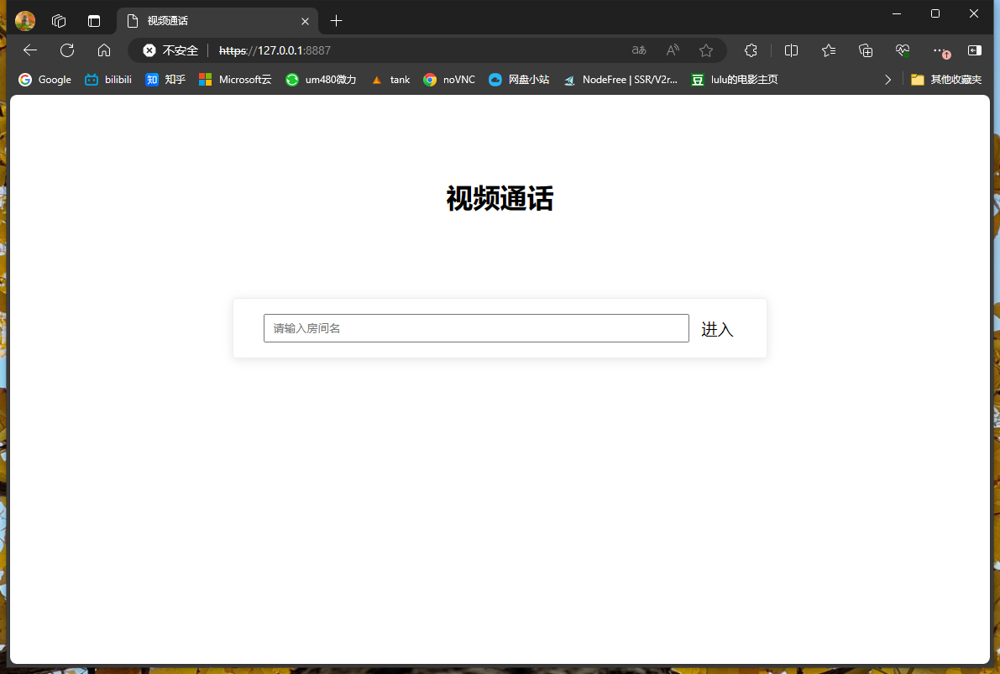
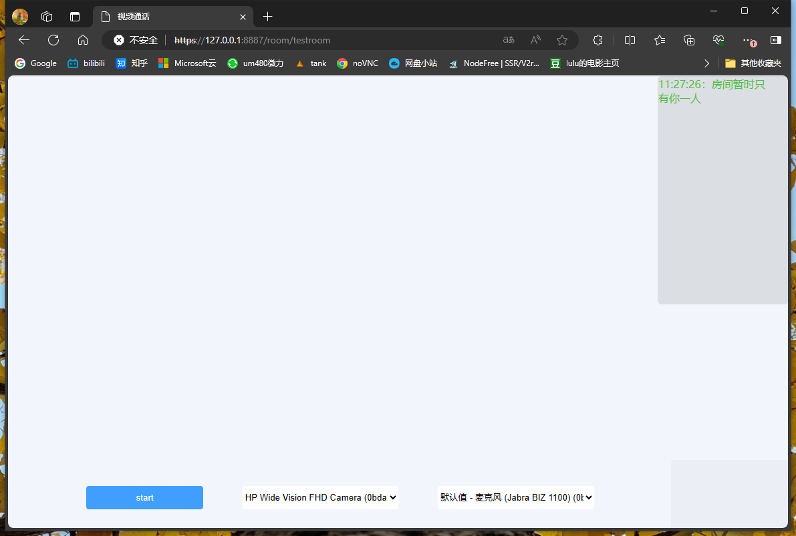
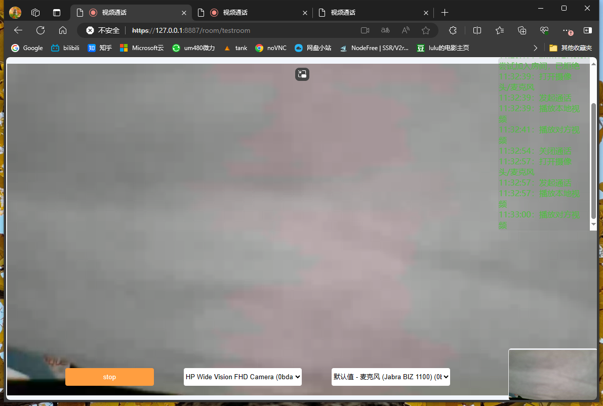

# 自建服务器实现视频通话 (WebRTC + WebSocket)

## 1.相关技术

本示例主要使用了 `WebRTC` 和 `WebSocket`：
- `WebRTC`（Web Real-Time Communication）即网页即时通信，是一个支持网页浏览器进行实时语音对话或视频对话的API。
- `WebSocket`是一种在单个TCP连接上进行全双工通信的协议。在 WebSocket 中，浏览器和服务器只需要完成一次握手，两者之间就直接可以创建持久性的连接，并进行双向数据传输。

## 2.服务器搭建
项目基于node.js，所以需要先安装node.js，

然后
### 第一步
cd到工程目录，安装node.js依赖
```
cd <your project path>

npm install express         # 安装依赖

```

### 第二步
由于使用摄像头需要https协议，所以需要生成https证书，
如果有域名的这里替换为域名的证书，没有的自己生成一个，浏览器会报不安全，但不影响使用
```
mkdir ssl

cd ssl

openssl req -nodes -new -x509 -keyout private-key.pem -out certificate.pem -days 3650

#没有openssl的先安装下openssl

```

### 第三步
返回工程目录，运行run.js
```
cd ..

node run.js                 # 访问 https://[ipv6]:8887

```

## 3.使用
第二步执行完成，没有问题的话就可以访问 https://[ipv4/ipv6]:8887

### 第一步
首页输入房间名，输入相同房间名的两个人进入同一个房间，第三个人将被拒绝加入


### 第二步
两人都加入房间以后，点击start开始通话,注意授予获取本地摄像头/麦克风/屏幕共享的权限


### 第三步
下方可以选择摄像头和麦克风，没有更多功能了


## 4.最后
项目参考了，感谢大佬对WebRTC技术的讲解
[github.com/shushushv/webrtc-p2p](https://github.com/shushushv/webrtc-p2p)


